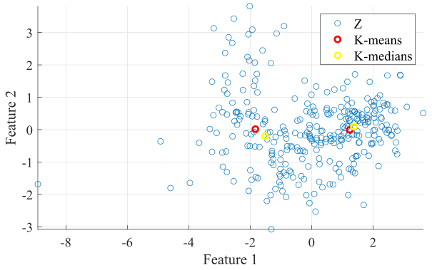

# Pattern-Recognition

> This repository is a comprehensive archive of projects and assignments undertaken for the *Pattern Recognition* course (TIP8311) at the Federal University of Ceará as part of my Master's curriculum.

## Introduction 📖

Pattern Recognition is a pivotal field within Machine Learning, offering insights into the systematic analysis of large datasets. It empowers us to uncover underlying patterns and similarities among data entities by examining their attributes. This process is crucial for making sense of complex datasets, enabling the identification of coherent groups and understanding their defining characteristics. In this project, we delve into fundamental techniques to reveal intricate relationships within data, thereby contributing to the broader knowledge base of pattern recognition and its applications in real-world scenarios.

## Assignments Description 🗃️

> [!NOTE]
> The main codes are in the files with a `.mlx` extension.

### [Assignment 1](ProblemSet1): Covariance Matrix Estimation
- **Description:** Estimating the covariance matrix is pivotal in pattern recognition, capturing relationships between dataset features. It's crucial for high-dimensional data analysis and interpretation. This assignment evaluates various estimation methods, explores matrix invertibility, and introduces Singular Value Decomposition (SVD).

### [Assignment 2](ProblemSet2): Principal Component Analysis (PCA)
- **Description:** PCA, a key technique for dimensionality reduction and feature extraction, aims to simplify high-dimensional data by capturing significant variances. This assignment involves PCA implementation and an exploration of its theoretical background.

### [Assignment 3](ProblemSet3): Pattern Classification and PCA
- **Description:** Essential in pattern recognition, quadratic and linear least squares classifiers distinguish classes using decision surfaces. This assignment implements the Gaussian Quadratic Classifier (GQC) and Linear Least Squares Classifier (LLSC), evaluating their statistical performance.

### [Assignment 4](ProblemSet4): Clustering
- **Description:** An unsupervised learning process, cluster analysis groups data based on similarities. This assignment implements k-means and k-medians techniques, evaluates cluster validity indices (Dunn's Index, Davies-Bouldin Index, Calinski-Harabasz Index), and conducts a statistical analysis of cluster characteristics.

## License 📄

This project is licensed under the MIT License - see the [LICENSE.md](LICENSE.md) file for details.

## Contact 📬

If you have any questions or suggestions about the project, please feel free to reach out:

- **LinkedIn**: [My LinkedIn Profile](https://www.linkedin.com/in/andreza-nascimento-ce/)
- **Email**: `andrezacosta@alu.ufc.br`
